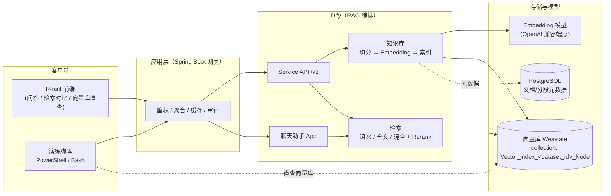

# Dify RAG Lab

基于 Dify 的 RAG 知识库实战工程：**Spring Boot 检索网关 + React 前端 + 双语演练脚本 + 技术文档**。

本项目以「企业内部知识库智能问答（RAG）」为落地方向，完整走一遍 **文档切分 → Embedding → 向量库写入 → 检索召回 → 重排 → 问答生成** 的全链路，并提供一个可扩展的服务骨架与一套可量化的检索评测手段。

## 架构



- **Dify** 承担 RAG 编排：切分、Embedding、索引、检索、Rerank 与对话生成；
- **向量库**（默认 Weaviate，可按 `VECTOR_STORE` 切换）只做向量与 chunk 的存储和近邻检索；
- **Java 网关** 是业务集成面：聚合多个 Dify 应用、做鉴权/限流/审计，并提供**检索对照实验**（Dify 检索 vs 自实现检索，验证同分同模型下的差异来源）；
- **前端** 不直接接触 Dify API Key，所有请求经网关转发。

## 技术栈

| 模块 | 技术 |
|---|---|
| 后端 | Spring Boot 3.3 · Java 17 · Maven · RestClient |
| 前端 | React 19 · Ant Design 6 · Vite 8 · TypeScript · axios |
| RAG 编排 | Dify（知识库 / 检索 / 聊天助手） |
| 向量库 | Weaviate（Dify 支持多引擎，可配置切换） |
| 脚本 | PowerShell 7 与 Bash 双版本（等价） |

## 功能特性

- **Dify Service API 封装**：创建知识库、上传文档（multipart）、索引状态轮询、三种方式检索、聊天问答；
- **向量库直查**：schema / 对象 / `nearVector` / `bm25`，亲眼验证 Dify 在向量库里存了什么；
- **检索对照实验**：同一 query 分别走 Dify 检索与 Java 自实现检索（Embedding → nearVector → BM25 → 加权融合），量化 Dify 的额外加工（Rerank、元数据过滤等）带来的差异；
- **示例语料与评测**：内置 8 份研发中台演示文档 + 14 条评测题，`hit@1 / hit@5` 打分脚本支撑"先定基准、再调参"；
- **技术文档**：方向论证与架构、向量库机制源码级拆解、分步演练指南、生产化落地清单、生产部署对标与前端选型。

## 快速开始

前置条件：

- 已部署 Dify（含向量库与 Embedding 模型配置）；
- 已在 Dify 创建知识库并生成**数据集 API Key**（知识库 → 设置 → API 访问）；
- 可选：聊天助手 App 及其 API Key（问答功能）。

### 0. Docker Compose（推荐）

如果 Dify 已经通过 Docker 启动，并且网络名是 `docker_default`，可以用本项目自带的 Compose 编排同时启动前后端：

```bash
cd path/to/dify-rag-lab

# 1. 准备环境变量
cp .env.example .env
# 编辑 .env，填入 DIFY_DATASET_ID / DIFY_DATASET_API_KEY / DIFY_APP_API_KEY 等

# 2. 一键构建并启动（推荐，自动读取 .env，避免 shell 旧变量覆盖）
./scripts/docker-up.sh --build

# 或者手动执行：
docker compose build backend frontend
docker compose up -d
```

> 注意：`docker compose` 会优先使用当前 shell 中已 export 的同名变量。
> 如果你之前 export 过 `DIFY_BASE_URL=http://localhost` 等旧值，可能覆盖 `.env` 导致容器内无法连接 Dify。
> 建议统一使用 `./scripts/docker-up.sh`，它会在启动前把 `.env` 变量重新导入当前环境。

验证：

```bash
docker compose ps
curl http://localhost:8081/api/rag/metadata
```

前端访问：

```text
http://localhost:8080
```

### 1. 启动后端网关（本地开发）

```bash
cd backend
# 方式一：Docker
docker build -t dify-rag-lab:0.0.1 .
docker run -d --name dify-rag-lab -p 8081:8081 \
  -e DIFY_BASE_URL=http://<dify-host> \
  -e WEAVIATE_URL=http://<weaviate-host> \
  -e DIFY_DATASET_ID=<dataset-id> \
  -e DIFY_DATASET_API_KEY=<dataset-api-key> \
  dify-rag-lab:0.0.1

# 方式二：本地 JDK 17 + Maven
mvn spring-boot:run
```

所有环境变量均可缺省启动，仅对应功能不可用（详见 `backend/README.md`）。

### 2. 启动前端

```bash
cd frontend
npm install
npm run dev        # http://localhost:5173（开发代理 /api → 8081）
```

### 3. 灌入演示语料并跑评测

```bash
# Windows (PowerShell 7)
.\scripts\03b-batch-upload.ps1
.\scripts\04b-evaluate.ps1

# Linux / macOS
./scripts/03b-batch-upload.sh
./scripts/04b-evaluate.sh
```

## 目录结构

```
dify-rag-lab/
├── backend/       # Spring Boot 检索网关
├── frontend/      # React 问答/检索前端
├── scripts/       # 演练脚本（.ps1 与 .sh 双版本）
├── sample-data/   # 演示语料与评测集
└── docs/          # 架构、机制、演练、生产化文档
```

## 文档索引

| 文档 | 内容 |
|---|---|
| `docs/01-应用方向与架构设计.md` | 方向论证、总体架构、接口契约 |
| `docs/02-Dify向量数据库机制详解.md` | 向量库机制源码级拆解（collection 命名、属性、检索实现） |
| `docs/03-分步演练指南.md` | 6 阶段实操：建库、入库、检索对比、直查、问答、清理 |
| `docs/04-生产化落地清单.md` | 检索质量 / 性能 / 高可用 / 安全 / 成本 checklist |
| `docs/05-生产部署对标与前端方案.md` | 生产环境差距分析、前端三种形态选型 |

## License

MIT（待补充 LICENSE 文件后生效）。
