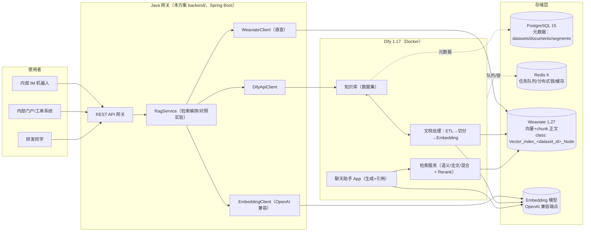

# 01 · 应用方向与架构设计

## 1. 学习目标

你已有 Dify + Weaviate 在跑，现在要搞懂的是**向量数据库在 Dify 里是怎么被使用的**。本方案围绕三个层次展开：

1. **机制层**：Dify 何时、如何把数据写入向量库？存了什么？检索时如何查？
2. **工程层**：如何用 Java（Spring Boot）对接 Dify 知识库 API，并**直查向量库**验证机制；
3. **生产层**：检索质量如何调优、如何度量、如何安全上线。

## 2. 方向选择

三个候选方向（均基于 Dify 知识库 + 向量库）：

| 候选方向 | 业务价值 | 对"学习向量库"的覆盖度 | 数据可得性 | 落地复杂度 |
|---|---|---|---|---|
| **A. 企业研发知识库智能问答**（技术规范/FAQ/产品文档 → 问答+引用溯源） | 高：研发效能直接受益 | ★★★★★（切分、embedding、召回、重排、评估全覆盖） | 高：手头文档即可 | 中 |
| B. 客服/工单智能助手 | 高 | ★★★★（偏对话编排，检索占比略低） | 中：需业务语料 | 中 |
| C. 私有代码库语义检索 | 高 | ★★★★（切分策略特殊，代码 token 化） | 高 | 高（需要代码库 ETL） |

**选定方向 A：企业研发知识库智能问答助手（RAG）**。理由：

- 它是 RAG 最典型、最"吃"向量库能力的场景，完整走一遍就等于把向量库用透了；
- 数据是你手头现成的技术文档/规范/FAQ，练习成本最低；
- 检索质量可度量（命中率、引用正确率），方便做 A/B 实验；
- Java 侧价值大：作为**检索网关**被内部系统（IM 机器人、门户、工单系统）集成。

> 说明：Dify 在这个方案里承担「RAG 编排器」（切分、Embedding、检索、Rerank、生成），向量数据库承担「存储与召回」，Java 网关承担「业务集成与直查验证」。三者的边界清晰，正好对应你要学的知识。

## 3. 总体架构



### 组件职责

| 组件 | 职责 | 与向量库的关系 |
|---|---|---|
| Dify 知识库 | 数据集/文档/分段管理，入库编排 | 决定 collection 名称、写入哪些属性、用什么切分 |
| Dify 检索服务 | 语义/全文/混合检索 + 重排 + 阈值过滤 | 直接调用向量库的 near_vector / bm25 |
| Weaviate | 向量与 chunk 存储、近邻检索 | **被使用者**，不自己算 embedding |
| PostgreSQL | Dify 元数据（文档、分段、索引状态、命中记录） | 与向量库互补：元数据在外，向量在内 |
| Java 网关 | 业务 API、直查向量库、检索对照实验 | 让你从"使用者"变成"理解者" |

## 4. 两条核心链路

### 4.1 知识入库链路（离线/异步）

```
上传文档 → ETL 格式转换 → 预处理(去停用词/多余空格/URL) → 切分(separator/max_tokens/chunk_overlap)
        → 逐 chunk 生成 Embedding（调 Embedding 模型）→ 批量写入 Weaviate collection → 回写元数据到 Postgres
```

- 由 Dify worker 异步执行，API 只返回 `document_id`，通过 `indexing-status` 轮询进度。
- 写入是**批量**的（`batch.dynamic()`，每批 100），UUID 由 chunk 内容确定性生成（`uuid5`），重复内容天然去重。
- 高可用细节：建 collection 用 Redis 分布式锁防并发；collection 已存在则跳过。

### 4.2 在线问答链路（同步）

```
用户问题 →（可选：改写）→ 检索：向量召回 + 关键词召回 → 融合/重排 → 阈值过滤 → top_k
        → 组装上下文（chunk 正文 + 引用）→ LLM 生成回答（带引用）→ 返回
```

- 检索参数（search_method / top_k / score_threshold / rerank）在知识库或每次请求中可调。
- 引用的精确度 = 检索质量 = 向量库调优水平。这是本方案演练的重点。

## 5. 接口契约（Java 网关对外）

| 方法 | 路径 | 说明 |
|---|---|---|
| POST | `/api/rag/retrieve` | 检索：`{query, search_method, top_k}` → 命中的 chunk + score + 引用 |
| POST | `/api/rag/chat` | 问答：`{query, conversation_id?}` → 回答 + 引用列表（走 Dify 聊天助手 App） |
| POST | `/api/rag/ingest` | 上传文档到指定知识库（multipart）→ `{document_id, batch}` |
| GET | `/api/vdb/collections` | 直查：列出 Weaviate 全部 collection（含 Dify 的） |
| GET | `/api/vdb/collections/{name}/objects` | 直查：看某个 collection 里到底存了什么 |
| POST | `/api/vdb/collections/{name}/search` | 直查：用 `nearVector` 做向量检索（自实现） |
| GET | `/api/rag/compare` | 对照实验：Dify 检索 vs Java 自实现检索（同 query 同 embedding） |

> 完整字段与示例见 `backend/` 工程源码与 docs/03 演练指南。

## 6. 关键设计决策

1. **Dify 只做编排，向量库独立存在**：不把向量库"内嵌"到业务系统里，而是通过 Dify API 使用 + 直查验证，这样既能获得 Dify 的完整能力，又能真正理解底层。
2. **检索网关做薄**：Java 网关不做切分/embedding（那是 Dify 的活），只做 API 聚合、鉴权、缓存、对照实验——职责单一，符合生产习惯。
3. **对照实验是学习抓手**：同一个 query，分别走「Dify 检索」和「Java 自实现（embedding→nearVector→BM25→加权融合）」，对比 top_k 命中差异，把"黑盒"变成"白盒"。
4. **演练不污染生产部署**：所有对 Dify/Weaviate 的操作都通过 API 或临时代理容器，不改 compose、不重启服务；演练结束一键清理。
